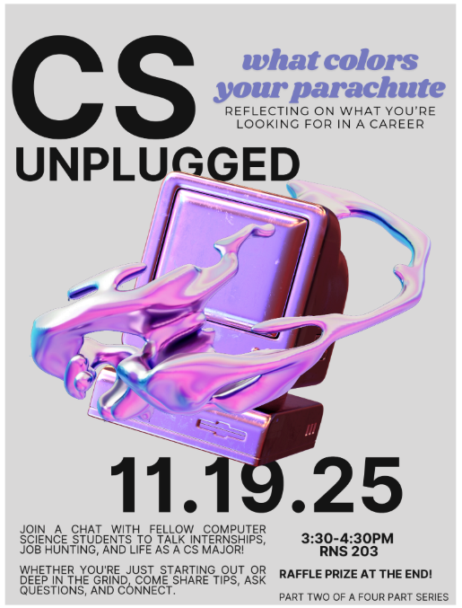

This four-part workshop series focuses on bringing together CS students to chat in an informal setting. Topics include: internships, career advice, application preparedness, job seeking.  

**Schedule**: *WIP*  
Session 1 (11/12/2025): From Intern to Insider: Lessons from Summer in Tech  
Session 2 (11/19/2025): What Colors Your Parachute: Reflecting on What You're Looking for in a Career  
Session 3 (02/25/2026): Inside the Hiring Mind: What Makes Candidates Stand Out  
Session 4 (03/25/2026): Level Up: Preparing for Interviews & Opportunities  

Posters:  
  

  